CUDA Path Tracer
================

**University of Pennsylvania, CIS 565: GPU Programming and Architecture, Project 3**

* Ziqiu Wang
* Tested on: Windows 11 Home, Intel Core Ultra 9 290HX Plus @ 2.7GHz 32GB, RTX 5080 16GB (Personal Computer)

## Cover Renders

<table>
  <tr>
    <td width="50%" align="center">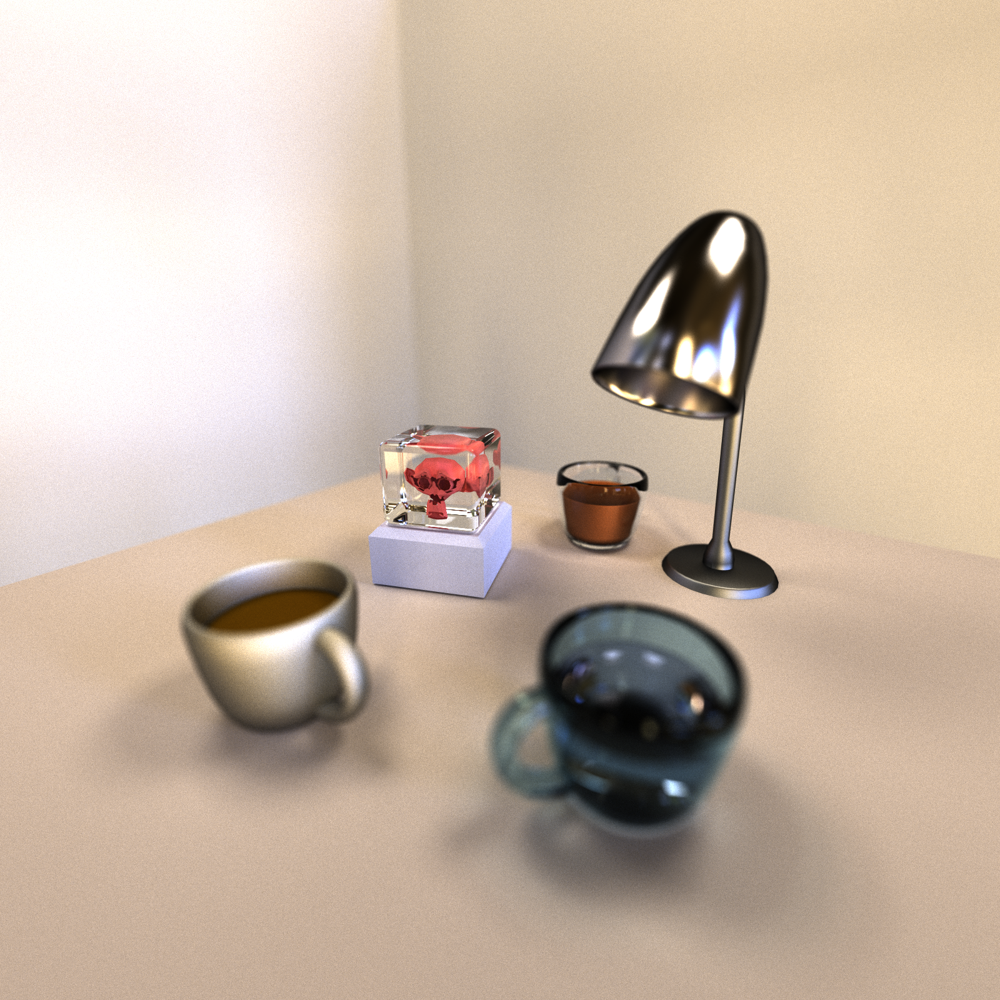</td>
    <td width="50%" align="center">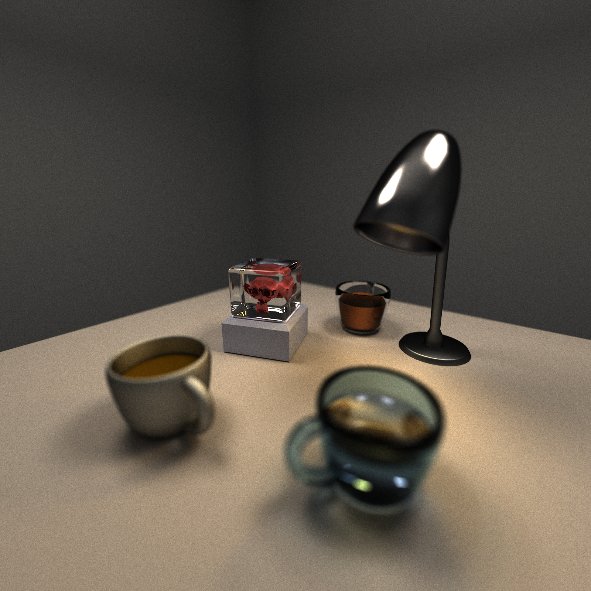</td>
  </tr>
  <tr>
    <td align="center"><strong>Daytime Tea Table</strong> Open scene</td>
    <td align="center"><strong>Nighttime Tea Table</strong> Closed scene</td>
  </tr>
</table>

## Project Overview

This project implements a CUDA path tracer with a number of optimizations. It supports:
- Diffuse, emissive, perfectly and imperfectly specular, and dielectric (refractive) materials
- Stream compaction, material sorting, and stochastic anti-aliasing
- OBJ mesh loading
- CPU-side BVH construction and GPU-side traversal
- Physically-based depth of field
- HDR environment lighting

This project also integrates CUDA-event timing for the main kernels and an ImGui window that offers interactive controls for the various optimizations and visual effects.

## Features & Performance Analysis

### Supported Materials

- **Diffuse:** We assume perfectly diffuse here, so rays are scattered in cosine-weighted random directions.
- **Emissive:** This material simply represents light sources and terminates paths that reach them.
- **Perfectly specular:** Rays follow the ideal mirror-reflection direction.
- **Imperfectly specular:** Rays are sampled within a Phong lobe centered around the ideal mirror-reflection direction. The roughness value controls the width of the lobe.
- **Dielectric (refractive):** To produce the Fresnel effect, rays are either reflected or refracted according to Schlick's approximation and the indices of refraction on either side of the surface. Total internal reflection is also implemented.

The following renders showcase how each material looks on a simple sphere in a Cornell box.

  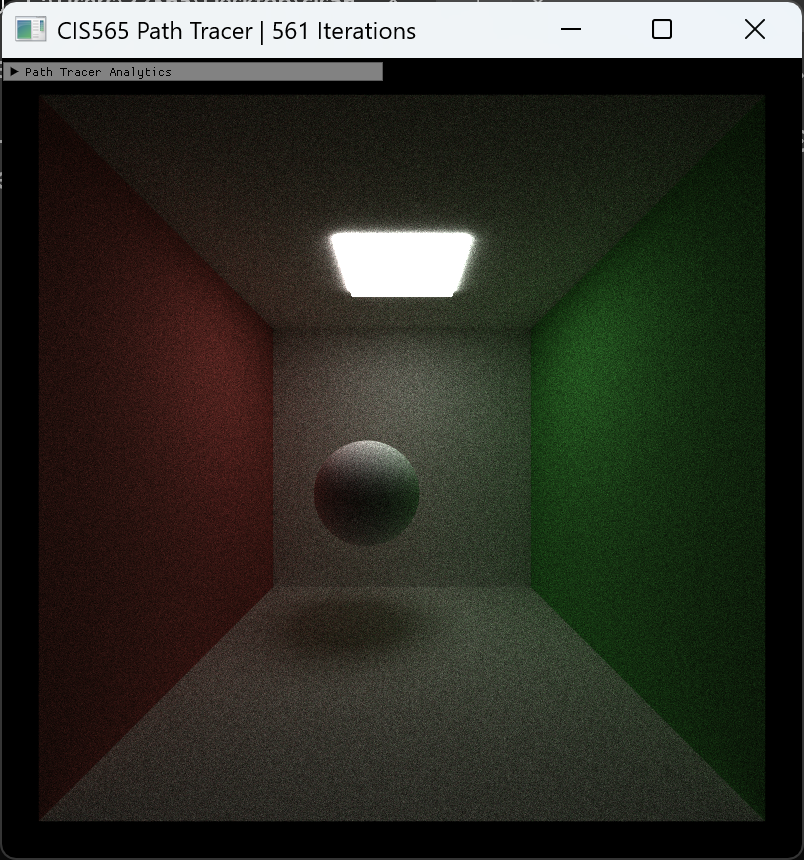 
  Diffuse white sphere

  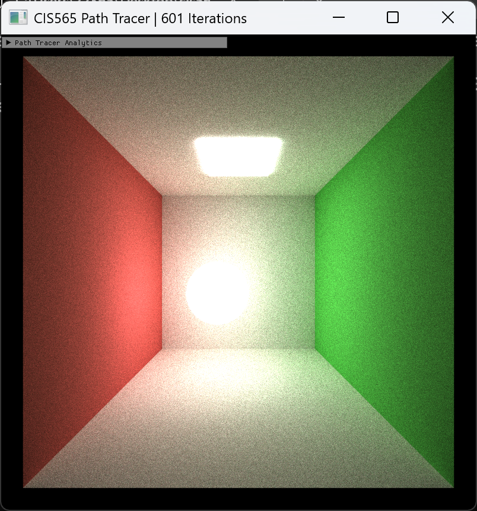 
  Emissive sphere

  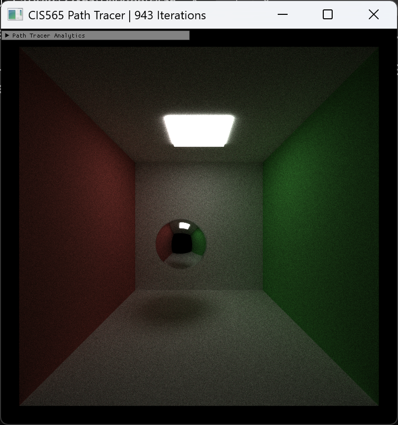 
  Perfectly specular sphere

  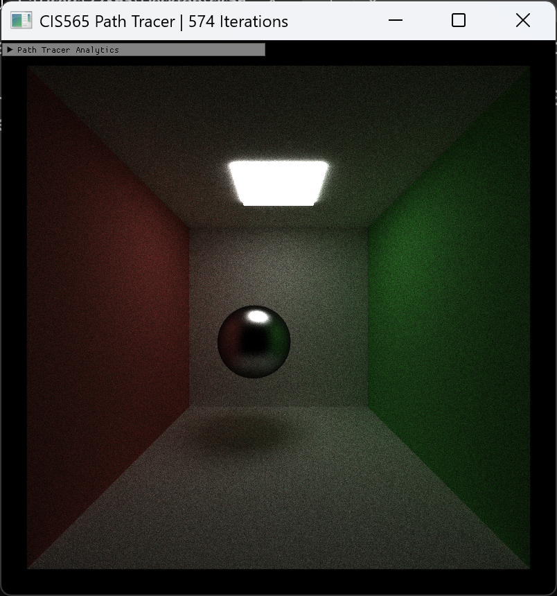 
  Imperfectly specular sphere with a roughness of 0.3

  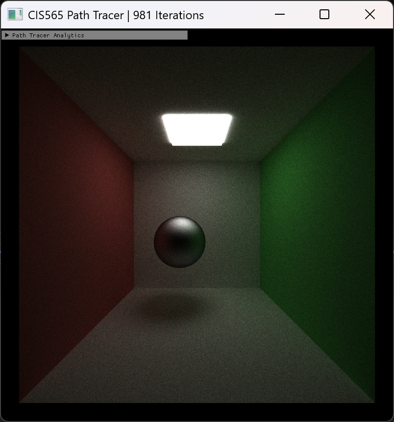 
  Imperfectly specular sphere with a roughness of 0.7

  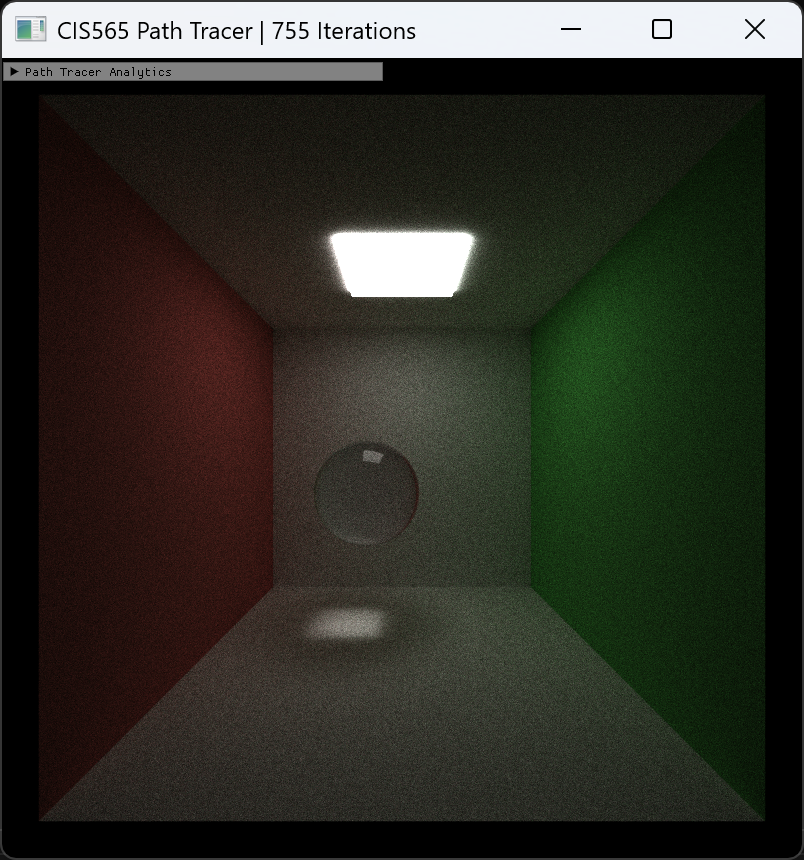 
  Dielectric sphere with an IOR of 1.5

### HDR Environment Lighting

Environment maps can be loaded into the scene via HDR images. Environment lighting can be turned on or off in the ImGui window to change the visual effects. When it is turned off, paths that miss all geometries in the scene will simply return the preset background color (default is black) times the throughput. When it is turned on, the directions of these escaping paths are converted to corresponding coordinates of the environment map, whose rotation and intensity can be configured. Enabling environment lighting therefore lets these paths receive directional illumination from the HDR image.

It is important to note that whether environment lighting is turned on or off, the environment map is always loaded into the GPU as a CUDA texture if it is configured in the scene file. Therefore, the performance impact of environment lighting primarily has to do with texture sampling costs. With 4K HDR maps used for environment lighting, there is no noticeable performance impact under all kinds of scenes.

The following renders showcase the visual effects of environment lighting with two different environment maps downloaded from online.

  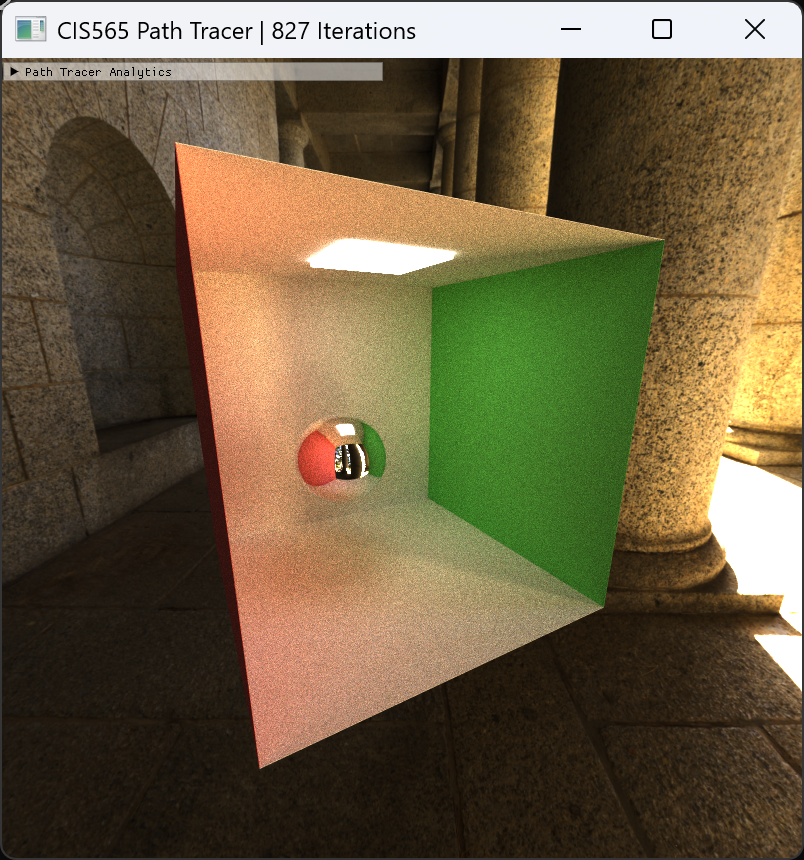 
  Pillar environment map

  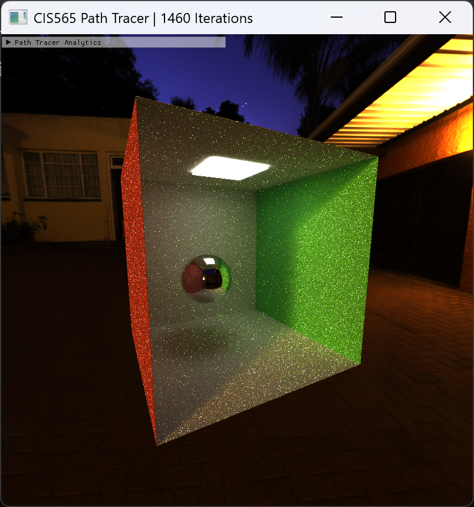 
  Courtyard night environment map

Notice how the cornell box with the courtyard night environment map suffers from fireflies due to the extremely bright spots in the map. It will thus be beneficial to implement multiple importance sampling (MIS) to reduce such visual artifacts.

### Physically-based Depth of Field

Depth of field is implemented with the ideal thin-lens equation in mind through randomizing the ray origins. For each camera ray through each pixel, the renderer finds its intersection on the configured focal plane, samples a random position on the aperture disk with concentric disk sampling, repositions the ray origin to that new aperture position, and redirects it toward the original focal point we have found. Since the new rays for each pixel are destined to converge at the focal distance, this effect keeps objects near the focus distance sharp while blurring nearer and farther objects, with a larger aperture producing stronger blur as the rays are more divergent; disabling it restores the classic pinhole camera model.

Since the implementation of this feature only involves changing the ray origins at the ray generation step of each iteration and a few other simple calculations, its impact on frame time should be almost negligible, and this matches my observations. For the two-piano scene (shown below) with the camera at its configured position (see piano_environment.json), enabling depth of field only increases the frame time from ~117 ms to ~123 ms, or about 5%. This is insignificant compared to other kernel run times.

The following renders showcase the visual effects of depth of field with different aperture sizes and focal distances in a scene with two piano meshes (one refractive with an IOR of 1.5 and the other imperfectly specular with a roughness of 0.5). You may read the exact numbers for aperture size and focal distance in the ImGui window at the top left.

  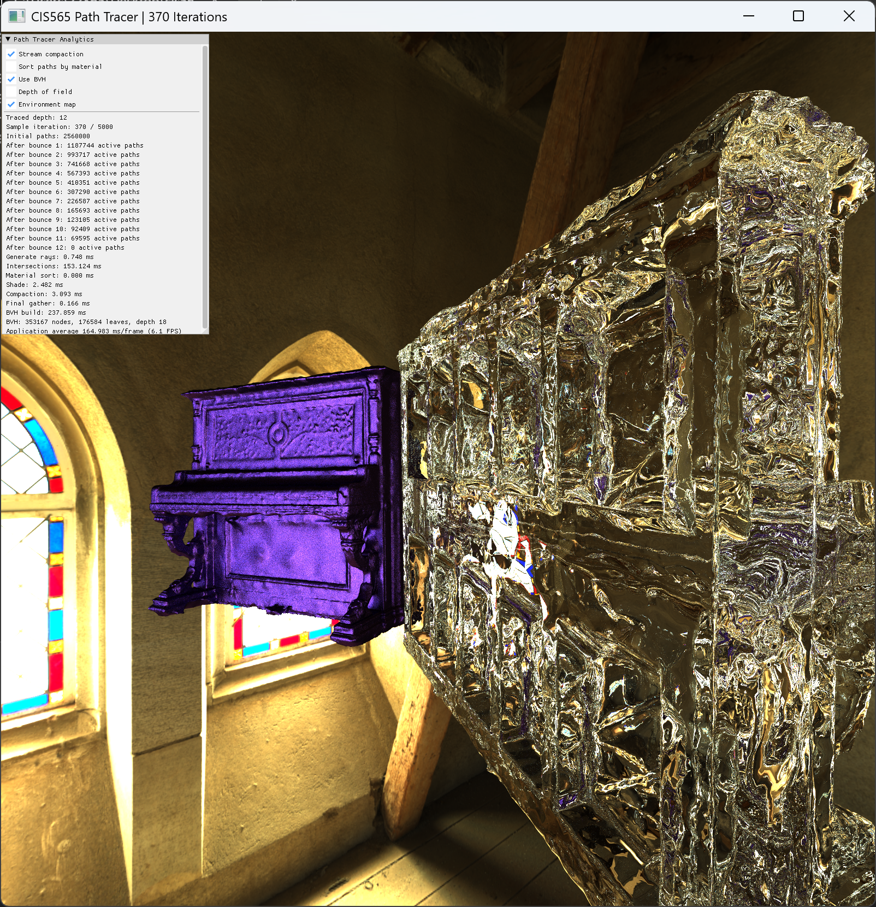 
  Depth of field OFF

  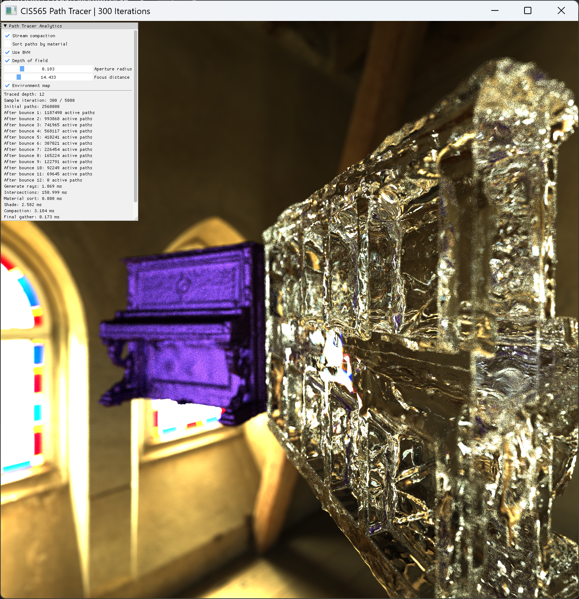 
  Small aperture, small focal distance

  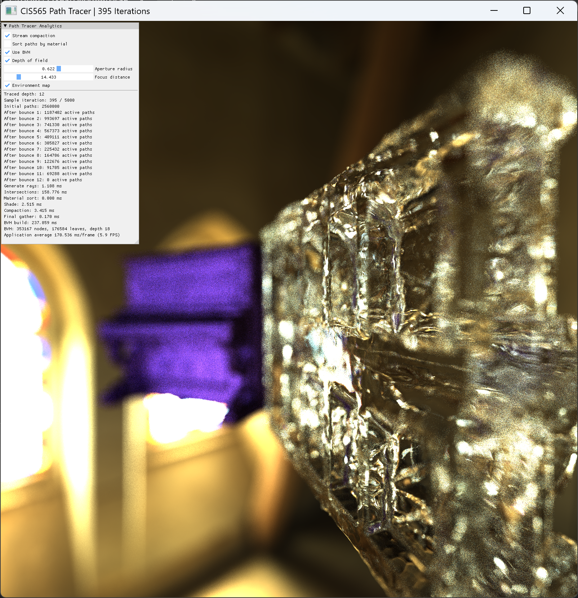 
  Large aperture, small focal distance

  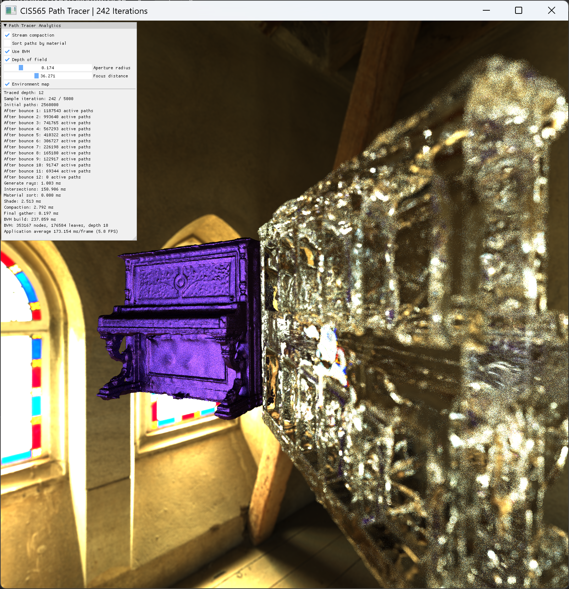 
  Small aperture, large focal distance

### Stochastic Anti-aliasing

Stochastic anti-aliasing uniformly jitters each camera ray to a random subpixel position. Averaging these samples over many iterations integrates across the pixel area, thereby smoothing diagonal edges and other high-frequency details that would otherwise appear jagged. This feature is not togglable inside the ImGui window, so disabling it would require changing the `ANTI_ALIASING` to 0. As with depth of field, the added runtime cost is negligibly small since we are only changing the ray origin and no complex calculation is involved.

The following renders show how a portion of a diffuse sphere looks without or with anti-aliasing enabled. It can be seen in the second image that the edge of the sphere is slightly blurrier and much less jagged.

<table>
  <tr>
    <td width="50%" align="center" valign="top"> Without Anti-aliasing</td>
    <td width="48%" align="center" valign="top"> With Anti-aliasing</td>
  </tr>
</table>

### OBJ Mesh Loading & BVH

Our path tracer supports OBJ mesh loading through [tinyObj](https://github.com/syoyo/tinyobjloader). The meshes are triangulated during import: vertex positions are transformed into world space, normals are transformed with the inverse-transpose of the model matrix, and missing vertex normals fall back to the triangle's geometric normal. Degenerate triangles are simply discarded. The material configured in the scene JSON is applied to the entire OBJ object.

OBJ meshes often consist of thousands, if not millions, of triangles. Therefore, a naive traversal through every single triangle during ray intersection testing is simply way too slow. To optimize scene traversal, our path tracer implements the Bounding Volume Hierarchy (BVH) acceleration structure. The CPU builds one BVH over every primitive, including OBJ triangles, spheres, and cubes. The top-down construction recursively computes axis-aligned bounding boxes (AABB) for both primitives and their centroids, chooses the axis with the widest centroid distribution, and uses a median split to divide the current range into two similarly sized groups. Recursion stops when the leaf size (configurable in the JSON scene) is reached, and the final result is a flat node array whose leaves contain contiguous primitives. The build time, node count, leaf count, and tree depth are recorded and shown in the ImGui window.

Once the BVH construction is completed, the primitive and node arrays are uploaded to the GPU, where each ray traverses the BVH with a fixed-size local stack storing the indices of the nodes to visit. A ray that does not intersect with a node's AABB simply ignores the entire branch, and the nearer child is pushed onto the stack after the farther child and is thus tested first so that an early hit is more likely. At leaf nodes, the ray simply tests against each primitive in the leaf for intersection.

Acceleration through BVH is togglable in the ImGui window. When it is turned off, scene traversal falls back to the naive brute-force path. 

The following renders contain various OBJ meshes downloaded from online, accelerated with BVH.

  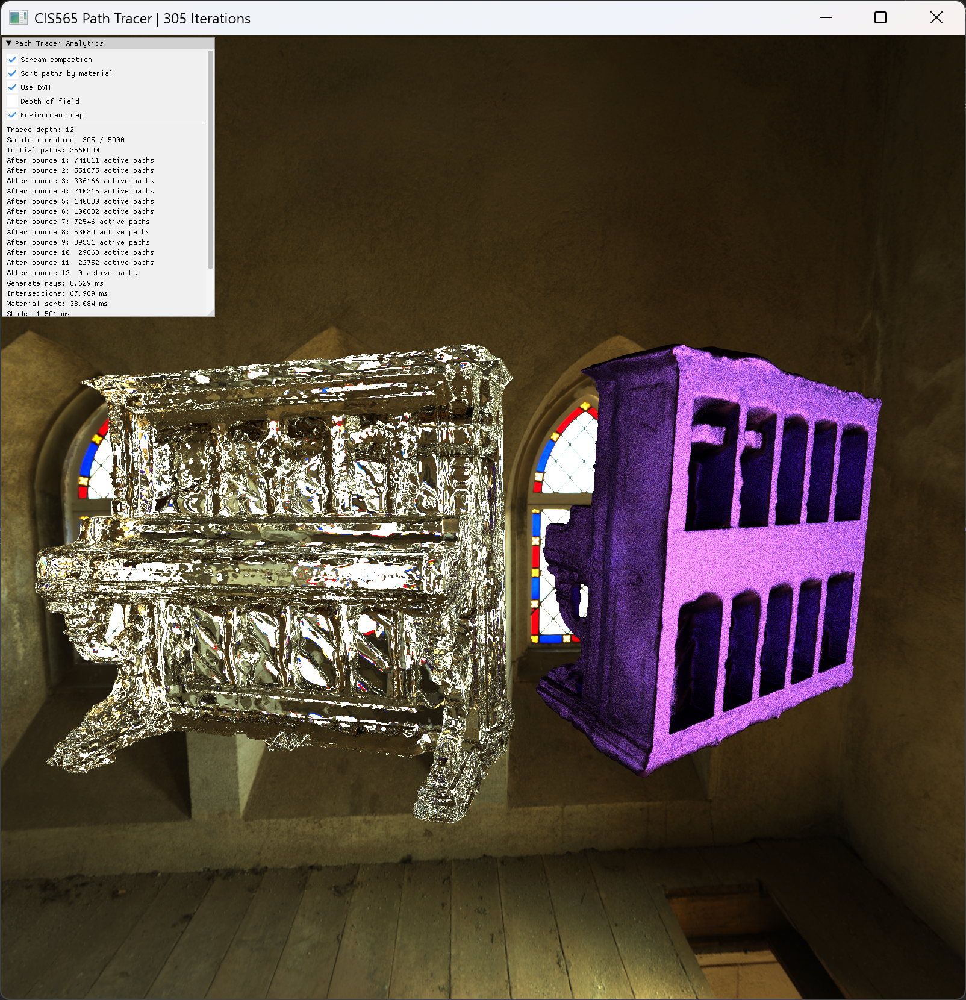 
  Two pianos, each with 284900 triangles, 1600x1600

  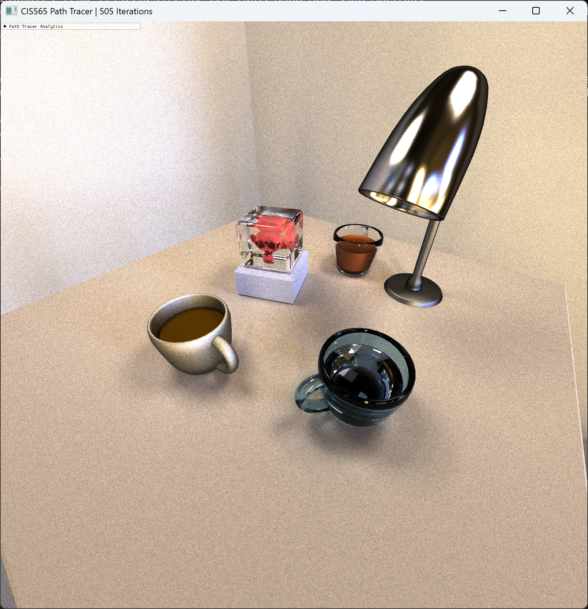 
  Tea table, 15 OBJ files, 17 meshes totaling ~65000 triangles, 1600x1600

BVH is best for complex scenes and meshes with many primitives. The performance benefit of using BVH is shown in the graphs below.

  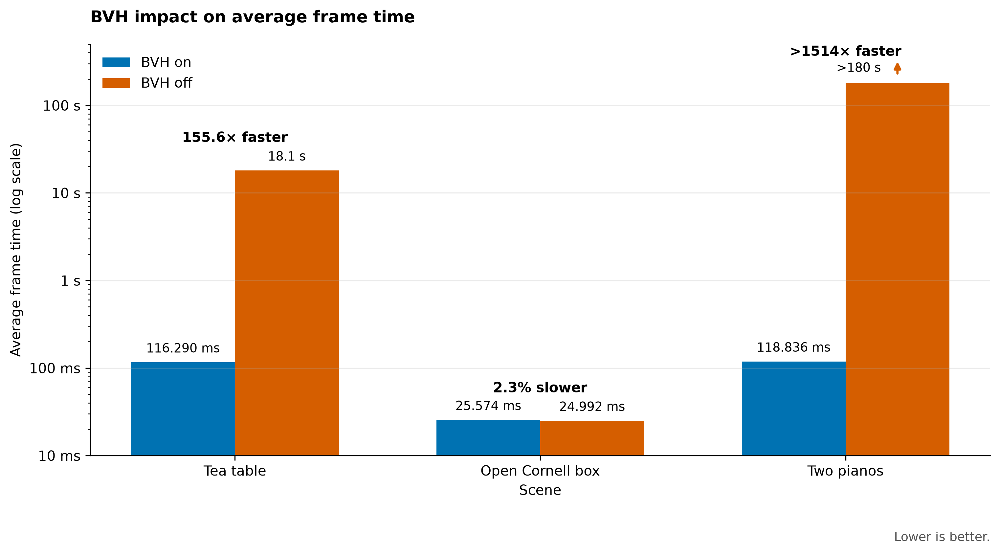 
  Average total frame time with and without BVH

  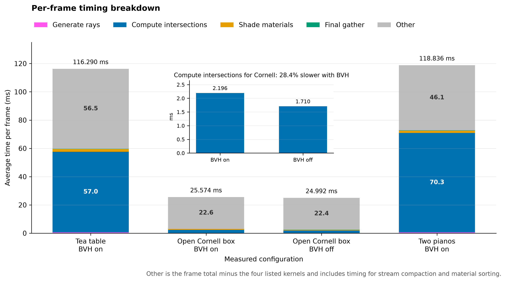 
  Breakdown of frame time (kernel times + other)

The timing data used to plot these graphs are shown in the table below. All tests had stream compaction and material sorting turned on. Times are average milliseconds per frame, so lower is better. `N/A` indicates that the path tracer was too slow to provide a meaningful kernel breakdown with BVH off; however, since we know that turning BVH off only affects the scene traversal component of the kernel for computing intersections on the GPU, the drastic slowdown must have been caused only by this kernel. Also note that the Cornell scenes has a resolution of 800x800 while the two-piano and tea-table scenes are 1600x1600.

| Scene | BVH | Frame time (ms) | Generate rays (ms) | Compute intersections (ms) | Shade materials (ms) | Final gather (ms) |
|---|:---:|---:|---:|---:|---:|---:|
| Tea table | On | 116.290 | 0.666 | 56.973 | 1.969 | 0.139 |
| Tea table | Off | ~18100 (manual) | N/A | N/A | N/A | N/A |
| Cornell | On | 25.574 | 0.152 | 2.196 | 0.622 | 0.053 |
| Cornell | Off | 24.992 | 0.158 | 1.710 | 0.633 | 0.060 |
| Two pianos | On | 118.836 | 0.629 | 70.318 | 1.625 | 0.178 |
| Two pianos | Off | >180000 (manual) | N/A | N/A | N/A | N/A |

The results confirm our expectation that BVH traversal is essential for complex scenes with many primitives (in fact, the path tracer is barely usable without BVH as it is way too laggy). It reduces the tea-table frame time from roughly 18.1 seconds to 116.290 ms, a speedup of approximately 155.6x. The two-piano scene takes more than three minutes per frame without BVH but only 118.836 ms with it, corresponding to a speedup over 1514x. We also note that, even though the two-piano scene has approximately nine times as many primitives as the tea-table scene, its intersection computation time increases by only 23.4%. Therefore, enabling BVH allows scene complexity to scale significantly while keeping the rendering overhead disproportionately small, thanks to its $O(\log N)$ traversal complexity.

Not shown in the table are the one-time BVH construction times on the CPU. For the tea-table scene this takes ~20 ms, and ~250 ms for the two-piano scene. This difference is expected given that the latter scene contains a lot more primitives, which naturally leads to much higher build complexity. However, this construction overhead is negligible in practice as it is simply amortized over the much longer rendering process.

By contrast, the simple open Cornell scene shows the opposite tradeoff. Enabling BVH increases average frame time by approximately 2.3%, while the intersection kernel increases from 1.710 ms to 2.196 ms, or 28.4%. With only a few analytic primitives, testing AABBs and maintaining the traversal stack costs more than directly testing every primitive. The other kernel times remain nearly unchanged, confirming that the performance difference is primarily due to scene traversal. It is therefore slightly beneficial to disable BVH for very simple scenes.

Even with BVH enabled, intersection testing remains the largest measured kernel cost in both mesh-heavy scenes, taking 56.973 ms for the tea table and 70.318 ms for the two pianos. Therefore, a potential next step would be to replace the current median-split heuristic with the Surface Area Heuristic (SAH), trading increased build time for even faster scene traversal.

### Stream Compaction

This optimization is togglable in the ImGui window (default is on). When it is turned on, after every ray bounce, paths that hit a light source, miss the scene entirely, or exhaust their bounce limit are marked as terminated through setting their remaining bounce count to 0. Then, a Thrust `remove_if` operation compacts the surviving `PathSegment` objects into a contiguous array and also updates the count of active paths, so the kernels in the subsequent bounce interation launch threads only for these paths.

Compaction adds the cost of examining and moving paths after each bounce, but becomes especially beneficial as paths terminate at different depths because it avoids repeatedly launching work for inactive paths and thus keeping some threads idle. The graphs below compare the performance benefits of stream compaction in open versus closed Cornell boxes and tea-table scene. All measurements use BVH with material sorting disabled. With compaction disabled, every bounce still launches the original 640000 paths for Cornell or 2560000 paths for tea table. Bounce 8 is shown as zero with compaction on because it is the configured maximum path depth.

  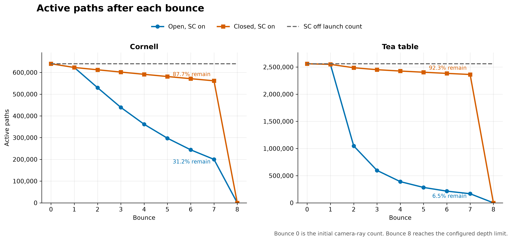 
  Number of active paths remaining after each bounce with stream compaction enabled

  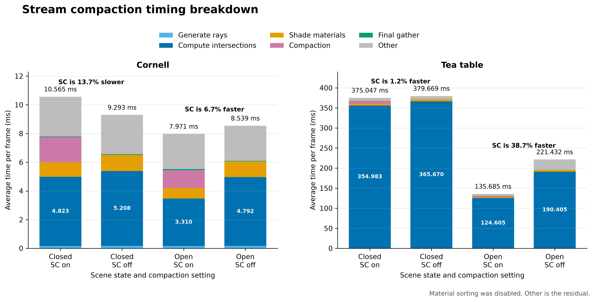 
  Breakdown of average frame time with or without stream compaction enabled

The active path counts used in the first graph are shown in the table below.

| Bounce | Cornell open | Cornell closed | Tea table open | Tea table closed |
|---:|---:|---:|---:|---:|
| 0 | 640,000 | 640,000 | 2,560,000 | 2,560,000 |
| 1 | 622,875 | 622,860 | 2,548,676 | 2,548,822 |
| 2 | 529,849 | 612,223 | 1,047,540 | 2,486,602 |
| 3 | 439,114 | 601,731 | 597,011 | 2,450,776 |
| 4 | 361,559 | 591,379 | 390,401 | 2,425,725 |
| 5 | 297,352 | 581,192 | 283,249 | 2,403,943 |
| 6 | 243,940 | 571,271 | 215,344 | 2,382,682 |
| 7 | 199,990 | 561,480 | 167,422 | 2,362,371 |
| 8 | 0 | 0 | 0 | 0 |

The timing measurements are average milliseconds per frame. The gray portion of each stacked bar is the unprofiled remainder of the application frame time after subtracting the four kernels and compaction.

| Scene | Stream compaction | Frame time (ms) | Generate rays (ms) | Compute intersections (ms) | Shade materials (ms) | Compaction (ms) | Final gather (ms) |
|---|:---:|---:|---:|---:|---:|---:|---:|
| Cornell closed | On | 10.565 | 0.168 | 4.823 | 1.004 | 1.749 | 0.044 |
| Cornell closed | Off | 9.293 | 0.178 | 5.208 | 1.130 | 0.000 | 0.040 |
| Cornell open | On | 7.971 | 0.164 | 3.310 | 0.733 | 1.241 | 0.070 |
| Cornell open | Off | 8.539 | 0.172 | 4.792 | 1.093 | 0.000 | 0.040 |
| Tea table closed | On | 375.047 | 0.737 | 354.983 | 4.886 | 7.086 | 0.125 |
| Tea table closed | Off | 379.669 | 0.737 | 365.670 | 5.148 | 0.000 | 0.160 |
| Tea table open | On | 135.685 | 0.688 | 124.605 | 2.659 | 2.390 | 0.163 |
| Tea table open | Off | 221.432 | 0.604 | 190.405 | 4.409 | 0.000 | 0.135 |

The open scenes benefit most from stream compaction because rays that escape through the missing wall get removed before later bounces. By bounce 7, only 31.2% of the original paths remain in the open Cornell scene and 6.5% remain in the open tea-table scene, compared with 87.7% and 92.3% in their closed versions. The resulting reduction in later kernel launches lowers the open Cornell frame time by 6.7% and the open tea-table frame time by 38.7%.

The kernel measurements show that these gains come from the two most computationally intensive kernels: intersection and shading. In the open Cornell scene, compaction reduces intersection time from 4.792 ms to 3.310 ms (30.9%) and shading time from 1.093 ms to 0.733 ms (32.9%). In the open tea-table scene, it reduces intersection time from 190.405 ms to 124.605 ms (34.6%) and shading time from 4.409 ms to 2.659 ms (39.7%). Without compaction, inactive paths still incur launch overhead; after their threads exit, those lanes also remain idle while active threads in the same warp continue working, thus wasting execution capacity and making both kernels take longer.

By contrast, closed scenes expose the cost of compaction when few paths terminate. In the closed Cornell box, the small intersection and shading savings do not recover the 1.749 ms compaction cost, making the frame 13.7% slower. The closed tea-table scene still improves slightly by 1.2% because the few avoided mesh intersections are expensive enough to offset its 7.086 ms compaction cost.

Finally, the tea-table timings are much larger than the Cornell timings because the tea-table tests render four times as many pixels and traverse a mesh-heavy scene rather than a few analytic primitives. This also makes stream compaction more valuable for the tea-table scene since removing one tea-table path avoids substantially more intersection work. Stream compaction is therefore most effective when paths terminate early and the remaining per-path work is expensive, while a simple, enclosed scene may render faster without it.

The screenshots below illustrate the test scenes used for data collection.
<table>
  <tr>
    <td width="25%" align="center" valign="top">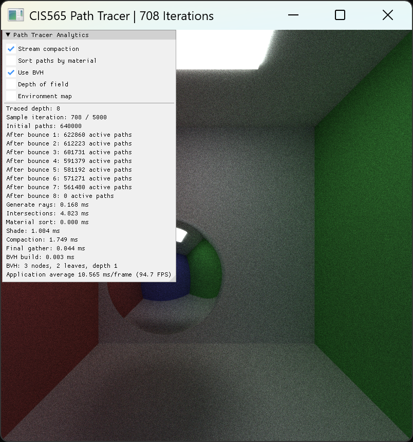 Cornell — Closed, SC on</td>
    <td width="25%" align="center" valign="top">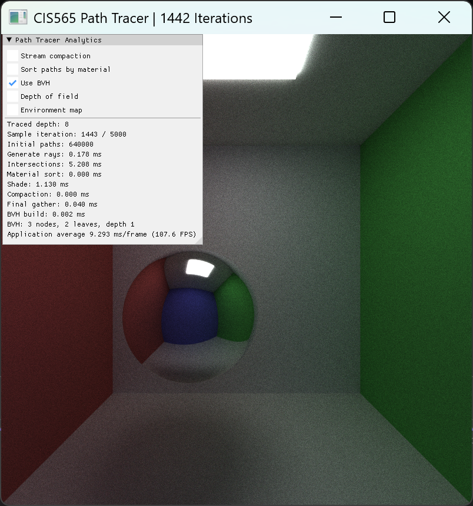 Cornell — Closed, SC off</td>
    <td width="25%" align="center" valign="top">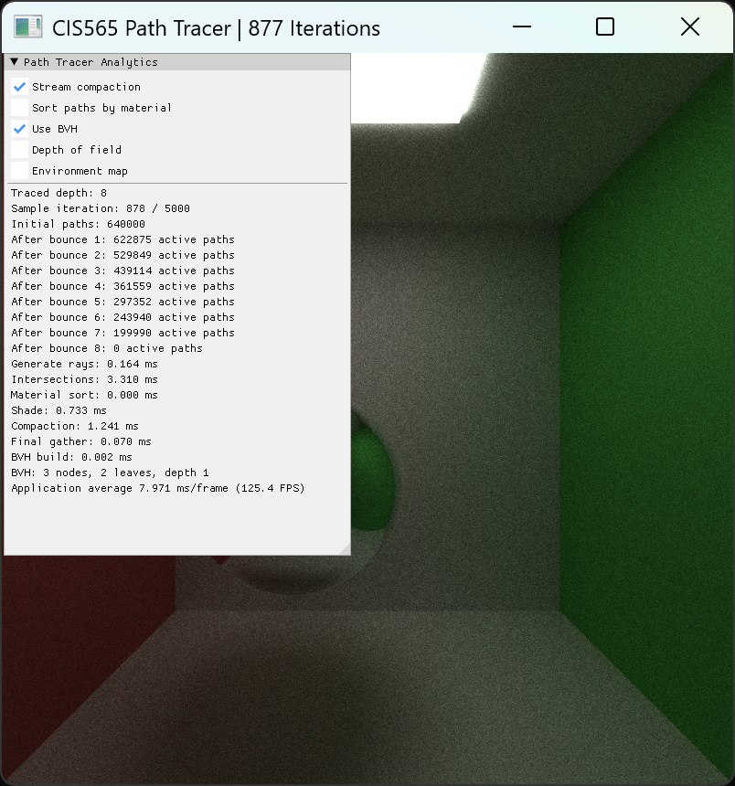 Cornell — Open, SC on</td>
    <td width="25%" align="center" valign="top">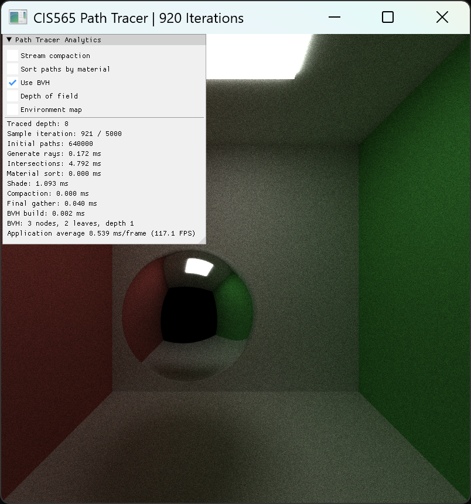 Cornell — Open, SC off</td>
  </tr>
  <tr>
    <td width="25%" align="center" valign="top">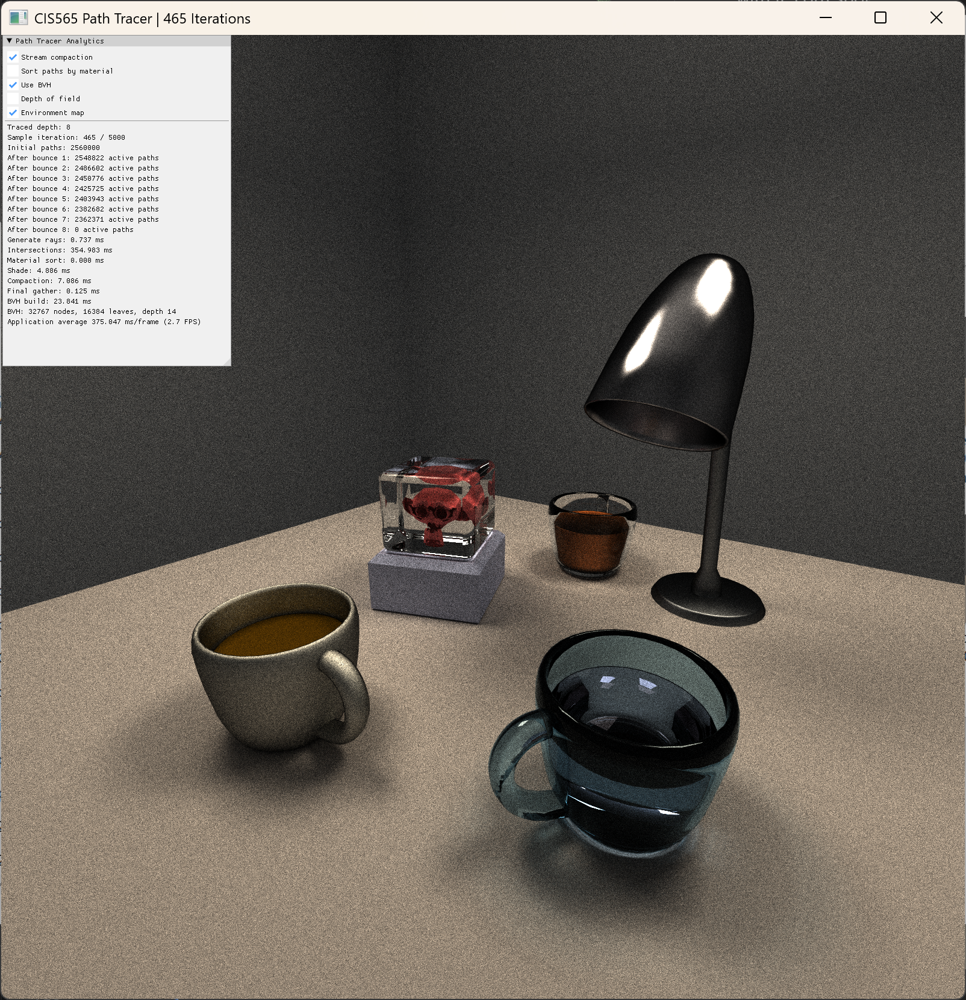 Tea table — Closed, SC on</td>
    <td width="25%" align="center" valign="top"> Tea table — Closed, SC off</td>
    <td width="25%" align="center" valign="top"> Tea table — Open, SC on</td>
    <td width="25%" align="center" valign="top">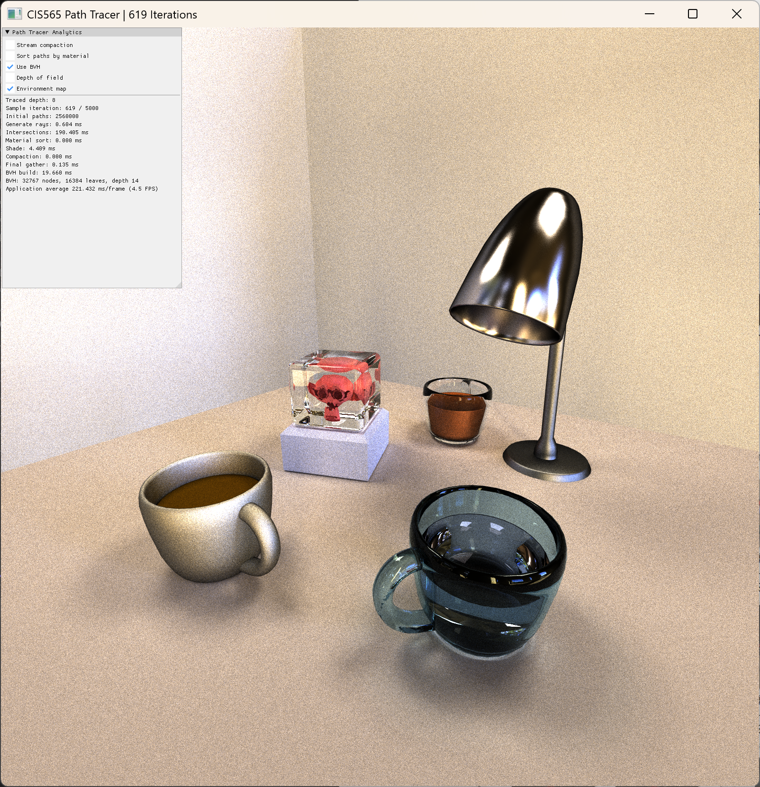 Tea table — Open, SC off</td>
  </tr>
</table>

### Material Sorting

After intersection testing, each active path receives a key corresponding to the material it hit, with separate keys for misses and already terminated paths. Then, a Thrust `sort_by_key` operation groups equal keys while moving each path and its corresponding intersection together through a zipped value iterator. Nearby threads in a warp are consequently more likely to execute the same material branch, thus reducing branch divergence in shading.

The graphs below show the performance impact of material sorting in scenes with different material complexity: closed Cornell box and closed tea-table scene.

  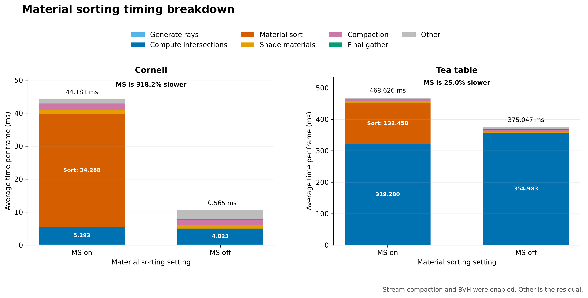 
  Average frame-time breakdown with material sorting on and off

Both scenes have stream compaction and BVH enabled. The Cornell scene still renders at 800x800 with only diffuse, emissive, and perfectly specular materials, while the more complex tea-table scene renders at 1600x1600 and contains various materials. The data used to create these graphs are shown below.

| Scene | Material sorting | Frame time (ms) | Generate rays (ms) | Compute intersections (ms) | Material sort (ms) | Shade materials (ms) | Compaction (ms) | Final gather (ms) | Other (ms) |
|---|:---:|---:|---:|---:|---:|---:|---:|---:|---:|
| Cornell | On | 44.181 | 0.186 | 5.293 | 34.288 | 1.152 | 1.941 | 0.067 | 1.254 |
| Cornell | Off | 10.565 | 0.168 | 4.823 | 0.000 | 1.004 | 1.749 | 0.044 | 2.777 |
| Tea table | On | 468.626 | 0.752 | 319.280 | 132.458 | 4.607 | 6.474 | 0.126 | 4.929 |
| Tea table | Off | 375.047 | 0.737 | 354.983 | 0.000 | 4.886 | 7.086 | 0.125 | 7.230 |

For the Cornell scene, material sorting increases the frame time from 10.565 ms to 44.181 ms, making the frame 318.2% slower, or approximately 4.18 times as expensive. The sorting operation alone takes 34.288 ms and accounts for 77.6% of the total frame. It also does not improve any of the other major components: intersection time increases by 9.7%, shading by 14.7%, and compaction by 11.0%. The scene has only a few simple materials and inexpensive shading branches, so reducing branch divergence cannot recover the significant overhead of sorting and moving every active path and intersection at each bounce.

The tea-table scene also fails to achieve a net speedup with material sorting despite some improvements in the core kernels' runtime. Sorting reduces intersection time from 354.983 ms to 319.280 ms (10.1%), shading from 4.886 ms to 4.607 ms (5.7%), and compaction from 7.086 ms to 6.474 ms (8.6%). But here is the question: why can sorting reduce the total intersection time per frame if it always happens after the current round of intersection computation? A likely explanation is that the reordered path array persists into the next bounce, so grouping paths by their previous material may also help group rays with adjacent origins and traversal behavior. Then in this subsequent intersection kernel, when neighboring threads traverse similar regions of the BVH, they are more likely to intersect the same bounding boxes and choose the same child branches. This may reduce warp divergence during the traversal and benifit from cache reuse for nearby BVH nodes. Altogether, with material sorting, the core kernels plus some other work save approximately 38.9 ms, but sorting itself costs 132.458 ms, producing a net frame-time increase of 93.579 ms, or 25.0%. The modest improvements hence cannot really justify sorting millions of paths at every bounce, even for this relatively complex scene.

Therefore, scene complexity changes the magnitude of the tradeoff, but not the conclusion for these tests: material sorting performs worst in simple scenes and remains unprofitable in the more complex tea-table scene. It may become worthwhile only when the materials in the scene are so complex that shading becomes very expensive and therefore the cost from branch divergence outweighs the sorting overhead.

The screenshots below illustrate the test scenes used for data collection.

<table>
  <tr>
    <td width="25%" align="center" valign="top">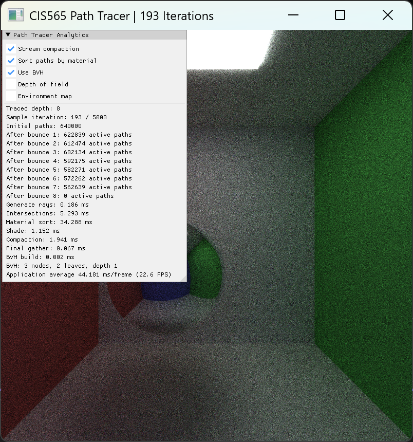 Cornell — MS on</td>
    <td width="25%" align="center" valign="top"> Cornell — MS off</td>
    <td width="25%" align="center" valign="top"> Tea table — MS on</td>
    <td width="25%" align="center" valign="top"> Tea table — MS off</td>
  </tr>
</table>

### Third Party Sources

- **[TinyObjLoader](https://github.com/tinyobjloader/tinyobjloader):** Copyright (c) 2012-present Syoyo Fujita and contributors. The bundled `tiny_obj_loader.h` is used to load and triangulate OBJ meshes and is distributed under the [MIT License](https://github.com/tinyobjloader/tinyobjloader/blob/release/LICENSE).
- **[Hallet And Davis Piano, 1896](https://skfb.ly/Bvt8):** Created by [John Fino (tauricity)](https://sketchfab.com/tauricity) and provided under the [Creative Commons Attribution license](https://creativecommons.org/licenses/by/4.0/). The OBJ mesh is used in the piano scenes with various materials applied.
- **[Table with Tea Cups](https://free3d.com/3d-model/table-with-tea-cups-74137.html):** Submitted to Free3D by [benzin](https://free3d.com/user/benzin) under the Personal Use License listed on the asset page. In this project, its original OBJ file has been separated into individual files for each object in the scene, which are then used in the tea-table scenes.
- **[Bell Tower](https://polyhaven.com/a/bell_tower):** HDRI created by Dario Barresi and provided by Poly Haven under the [CC0 license](https://polyhaven.com/license). It is used for environment lighting.
- **[Pillars](https://polyhaven.com/a/pillars):** HDRI created by Greg Zaal and provided by Poly Haven under the [CC0 license](https://polyhaven.com/license). It is used for environment lighting.
- **[Courtyard Night](https://polyhaven.com/a/courtyard_night):** HDRI created by Greg Zaal and provided by Poly Haven under the [CC0 license](https://polyhaven.com/license). It is used for environment lighting.
